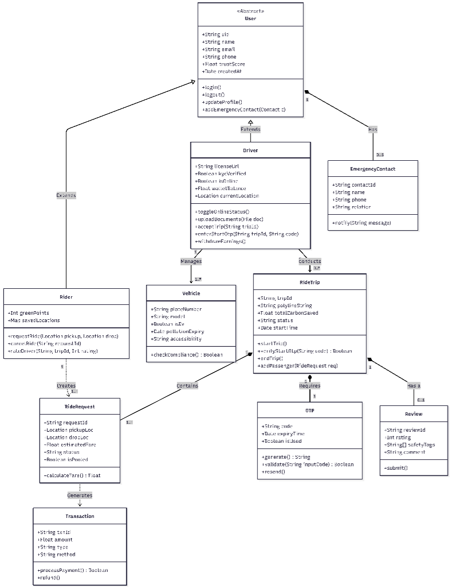
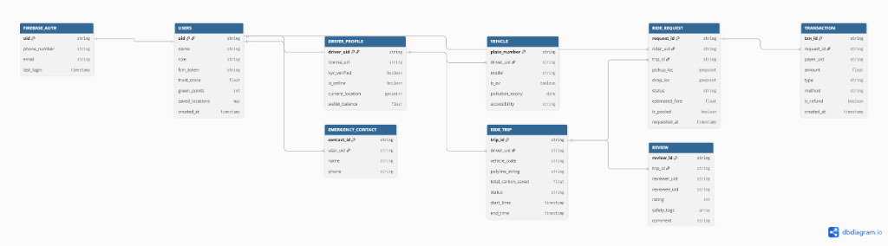
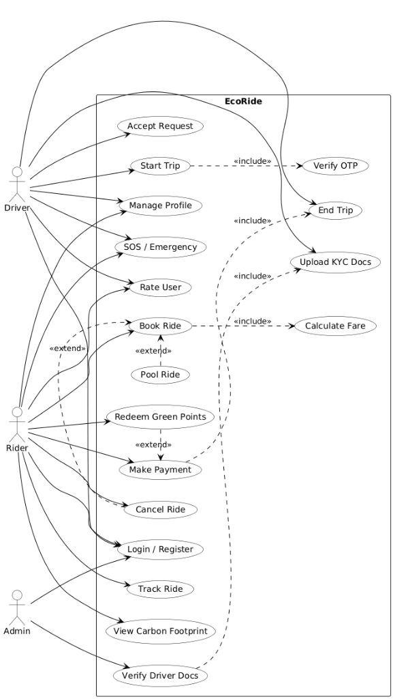
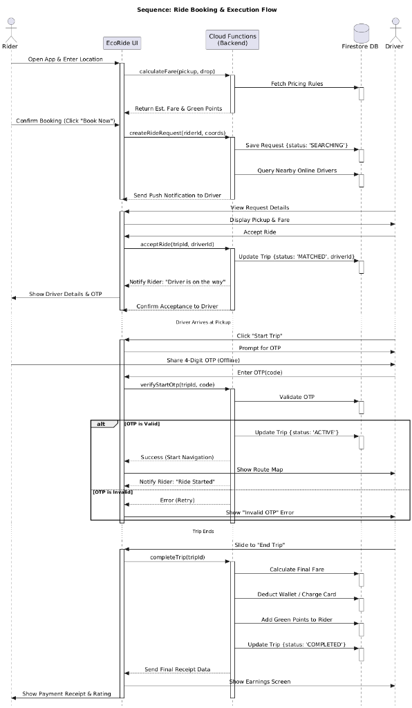

# Eco-Ride

Eco-Ride is a comprehensive ride-sharing platform focused on eco-friendly transportation, built with modern web technologies.

## Table of Contents

- [Intro](#intro)
- [About](#about)
- [Installing and Updating](#installing-and-updating)
- [Usage](#usage)
- [Running Tests](#running-tests)
- [Environment Variables](#environment-variables)
- [System Architecture](#system-architecture)
- [Maintainers](#maintainers)
- [License](#license)

## Intro

Eco-Ride allows users to book eco-friendly rides, drivers to manage their trips, and admins to oversee the platform operations via a modern web interface and mobile application.

## About

Eco-Ride is designed to provide a seamless transportation experience while promoting sustainability. Key features include:

- **Real-time Ride Tracking**: Integrated with Google Maps for accurate location services.
- **Secure Payments**: Powered by Stripe for reliable transactions.
- **Role-Based Access**: Specialized interfaces for Riders, Drivers, and Admins.
- **Scalable Backend**: Built on Node.js/Express with Firebase services.
- **Cross-Platform**: Accessible via a responsive Web App (Next.js) and Mobile App (React Native).

The platform leverages a monorepo structure managed by **Turborepo**, ensuring efficient development, shared configurations, and optimized build processes.

## Installing and Updating

To install and update Eco-Ride, follow the instructions below.

### Prerequisites

Ensure you have the following installed on your system:

- **Node.js**: v18 or higher (LTS recommended)
- **pnpm**: Package manager (install via `npm i -g pnpm`)
- **Git**: Version control system

### Installation

To install the project, you should clone the repository and install the dependencies:

1.  **Clone the repository:**
    ```bash
    git clone https://github.com/Adhikkesh/Eco-Ride.git
    cd Eco-Ride
    ```

2.  **Install dependencies:**
    ```bash
    pnpm install
    ```
    This command installs all dependencies for the entire monorepo, including web, mobile, and backend applications.

3.  **Set up Environment Variables:**
    Create a `.env` file in the `apps/web` and `apps/backend/server` directories based on the provided documentation or template. Essential keys include:
    - Firebase Configuration
    - Google Maps API Key
    - Stripe Secret/Public Keys

## Usage

### Development

To start the development environment for all applications concurrently:

```bash
pnpm dev
```

This command uses Turbo to launch:
- **Web Application**: Available at `http://localhost:3000`
- **Backend Server**: Runs on port `3001` (default)
- **Simulator**: Runs on its configured port

### Production Build

To build the project for production:

```bash
pnpm build
```

To start the production server:

```bash
pnpm start
```

### Mobile Application

To run the mobile application separately:

```bash
cd apps/mobile
npx expo start
```
Use the Expo Go app on your Android/iOS device to scan the QR code and run the app.

## Running Tests

Tests are implemented using **Vitest** for the backend services. To run the tests suite:

```bash
pnpm test
```

This will execute unit and integration tests across the packages.

To run tests with coverage reporting:

```bash
pnpm test:coverage
```

## Environment Variables

Eco-Ride exposes the following environment variables. Ensure these are configured in your `.env` files:

- `DATABASE_URL`: Connection string for the database (if applicable).
- `FIREBASE_API_KEY`: API Key for Firebase services.
- `FIREBASE_AUTH_DOMAIN`: Firebase Auth Domain.
- `FIREBASE_PROJECT_ID`: Firebase Project ID.
- `GOOGLE_MAPS_API_KEY`: API Key for Google Maps integration.
- `STRIPE_SECRET_KEY`: Secret Key for server-side Stripe operations.
- `NEXT_PUBLIC_STRIPE_PUBLISHABLE_KEY`: Public Key for client-side Stripe operations.
- `PORT`: Port number for the backend server (default: 3001).

## System Architecture

### Tech Stack

- **Frontend (Web)**: [Next.js 15](https://nextjs.org/), TypeScript, [Tailwind CSS 4](https://tailwindcss.com/)
- **Mobile**: [React Native](https://reactnative.dev/), [Expo](https://expo.dev/)
- **Backend**: [Node.js](https://nodejs.org/), [Express](https://expressjs.com/), [Firebase Admin SDK](https://firebase.google.com/)
- **Database**: Firestore (NoSQL)
- **Tools**: [Turborepo](https://turbo.build/), [Biome](https://biomejs.dev/) (Linting/Formatting)

### Diagrams

#### Class Diagram
An overview of the system's object-oriented structure, including Users, Drivers, Rides, and Vehicles.



#### ER Diagram (Entity-Relationship)
Visualizes the database schema, including users, ride requests, trips, transactions, and vehicle details within Firestore.



#### Use Case Diagram
Illustrates the interactions between the primary actors (Rider, Driver, Admin) and the system's use cases.



#### Sequence Diagram (Time Sequence)
Depicts the chronological sequence of interactions during a typical ride booking and execution flow.



## Maintainers

Currently maintained by the **Eco-Ride Development Team**.

## License

This project is proprietary and confidential. Unauthorized copying, distribution, or use of this file, via any medium, is strictly prohibited.
