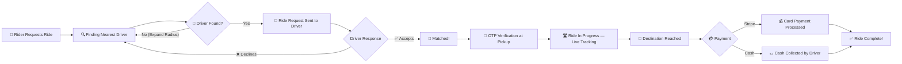

<p align="center">
  
</p>

<h1 align="center">🌿 Eco-Ride</h1>

<p align="center">
  <strong>A comprehensive ride-sharing platform focused on eco-friendly transportation, built with modern web technologies.</strong>
</p>

<p align="center">
  
  
  
  
  
  
  
  
</p>

<p align="center">
  
  
</p>

---

## Table of Contents

- [Intro](#intro)
- [About](#about)
- [How It Works](#how-it-works)
- [Features](#features)
- [Monorepo Structure](#monorepo-structure)
- [Installing and Updating](#installing-and-updating)
- [Usage](#usage)
- [Running Tests](#running-tests)
- [CI/CD Pipeline](#cicd-pipeline)
- [Environment Variables](#environment-variables)
- [API Documentation](#api-documentation)
- [System Architecture](#system-architecture)
- [Security](#security)
- [Scripts Reference](#scripts-reference)
- [Maintainers](#maintainers)
- [License](#license)

## Intro

Eco-Ride allows users to book eco-friendly rides, drivers to manage their trips, and admins to oversee the platform operations via a modern web interface and mobile application.

<table>
  <tr>
    <td align="center" width="25%">
      <h3>🗺️</h3>
      <b>Real-time GPS</b><br/>
      <sub>Live tracking with smooth map animations powered by Google Maps</sub>
    </td>
    <td align="center" width="25%">
      <h3>💳</h3>
      <b>Stripe + Cash</b><br/>
      <sub>Flexible payment options — card via Stripe or cash on delivery</sub>
    </td>
    <td align="center" width="25%">
      <h3>👥</h3>
      <b>3 User Roles</b><br/>
      <sub>Dedicated dashboards for Riders, Drivers, and Admins</sub>
    </td>
    <td align="center" width="25%">
      <h3>📱</h3>
      <b>Cross-Platform</b><br/>
      <sub>Web (Next.js) + Mobile (React Native / Expo)</sub>
    </td>
  </tr>
  <tr>
    <td align="center" width="25%">
      <h3>🔑</h3>
      <b>OTP Verification</b><br/>
      <sub>Secure 4-digit OTP at pickup — revealed only within 100m</sub>
    </td>
    <td align="center" width="25%">
      <h3>🔍</h3>
      <b>Smart Matching</b><br/>
      <sub>Expanding radius algorithm finds nearest driver up to 100km</sub>
    </td>
    <td align="center" width="25%">
      <h3>🛡️</h3>
      <b>KYC & Verification</b><br/>
      <sub>Driver license & document verification via Admin portal</sub>
    </td>
    <td align="center" width="25%">
      <h3>⚡</h3>
      <b>CI/CD Pipeline</b><br/>
      <sub>GitHub Actions with type-check, test, and build stages</sub>
    </td>
  </tr>
</table>

## About

Eco-Ride is designed to provide a seamless transportation experience while promoting sustainability. Key features include:

- **Real-time Ride Tracking**: Integrated with Google Maps for accurate location services.
- **Secure Payments**: Powered by Stripe for reliable transactions.
- **Role-Based Access**: Specialized interfaces for Riders, Drivers, and Admins.
- **Scalable Backend**: Built on Node.js/Express with Firebase services.
- **Cross-Platform**: Accessible via a responsive Web App (Next.js) and Mobile App (React Native).

The platform leverages a monorepo structure managed by **Turborepo**, ensuring efficient development, shared configurations, and optimized build processes.

## How It Works

The complete ride booking lifecycle from request to payment:



### Detailed Flow

| Step | Actor | Action | System Response |
|------|-------|--------|-----------------|
| 1 | **Rider** | Enters pickup & destination | Calculates ETA, fare estimate, and finds nearby drivers |
| 2 | **System** | Expanding radius search (up to 100km) | Matches the nearest available driver |
| 3 | **Driver** | Accepts or declines the request | If declined, auto re-matches with next closest driver |
| 4 | **Driver** | Arrives at pickup location | OTP is revealed to rider only when driver is within 100m |
| 5 | **Rider** | Shares 4-digit OTP with driver | Driver verifies OTP → ride status becomes `IN_PROGRESS` |
| 6 | **System** | Real-time GPS tracking | Live car movement rendered on both rider & driver maps |
| 7 | **Driver** | Reaches destination & completes ride | Rider is prompted for payment (Stripe or Cash) |
| 8 | **Rider** | Completes payment | Ride marked complete, driver freed for new rides |

## Features

### 🚗 For Riders
- Book rides with real-time ETA and fare estimation
- Live GPS tracking with smooth car movement animation on map
- Multiple payment options — **Stripe** (card) and **Cash**
- Save favorite locations (Home, Work, etc.)
- OTP-based ride verification for safety
- Ride history and receipts

### 🛞 For Drivers
- Accept/reject ride requests in real-time
- Turn-by-turn navigation with live map
- Earnings dashboard and trip history
- KYC & license verification during onboarding
- Vehicle management and registration

### 🔧 For Admins
- Driver document verification portal
- User and ride management dashboard
- Platform analytics and oversight
- Role and access management

## Monorepo Structure

This project uses a **Turborepo**-powered monorepo with the following layout:

```
Eco-Ride/
├── apps/
│   ├── web/              # Next.js 15 web application (Rider, Driver & Admin UI)
│   ├── mobile/           # React Native + Expo mobile app
│   ├── backend/
│   │   ├── server/       # Express.js REST API server
│   │   └── simulator/    # Ride simulation service for testing
│   └── server/           # Serverless / edge functions
├── packages/
│   ├── shared/           # Shared utilities, types, and constants
│   └── typescript-config/ # Shared TypeScript configurations
├── assets/               # Architecture & UML diagrams
├── docs/                 # Auto-generated TypeDoc API documentation
├── .github/workflows/    # CI/CD pipeline configuration
├── turbo.json            # Turborepo pipeline configuration
├── biome.json            # Biome linter & formatter configuration
└── package.json          # Root workspace configuration
```

## Installing and Updating

To install and update Eco-Ride, follow the instructions below.

### Prerequisites

Ensure you have the following installed on your system:

- **Node.js**: v18 or higher (LTS recommended)
- **pnpm**: Package manager (install via `npm i -g pnpm`)
- **Git**: Version control system

### Installation

To install the project, you should clone the repository and install the dependencies:

1.  **Clone the repository:**
    ```bash
    git clone https://github.com/Adhikkesh/Eco-Ride.git
    cd Eco-Ride
    ```

2.  **Install dependencies:**
    ```bash
    pnpm install
    ```
    This command installs all dependencies for the entire monorepo, including web, mobile, and backend applications.

3.  **Set up Environment Variables:**
    Create a `.env` file in the `apps/web` and `apps/backend/server` directories based on the provided documentation or template. Essential keys include:
    - Firebase Configuration
    - Google Maps API Key
    - Stripe Secret/Public Keys

## Usage

### Development

To start the development environment for all applications concurrently:

```bash
pnpm dev
```

This command uses Turbo to launch:
- **Web Application**: Available at `http://localhost:3000`
- **Backend Server**: Runs on port `3001` (default)
- **Simulator**: Runs on its configured port

### Production Build

To build the project for production:

```bash
pnpm build
```

To start the production server:

```bash
pnpm start
```

### Mobile Application

To run the mobile application separately:

```bash
cd apps/mobile
npx expo start
```
Use the Expo Go app on your Android/iOS device to scan the QR code and run the app.

## Running Tests

Tests are implemented using **Vitest** for the backend services. To run the tests suite:

```bash
pnpm test
```

This will execute unit and integration tests across the packages.

To run tests with coverage reporting:

```bash
pnpm test:coverage
```

## CI/CD Pipeline

Eco-Ride uses **GitHub Actions** for continuous integration. The pipeline is triggered on every push and pull request to `main`/`master` branches.

The CI workflow runs the following jobs in sequence:

| Job | Description | Command |
|-----|-------------|---------|
| **Type Check** | Validates TypeScript types across the monorepo | `pnpm run check-types` |
| **Test** | Runs the full Vitest test suite | `pnpm run test` |
| **Build** | Builds all apps for production (runs after Type Check & Test pass) | `pnpm run build` |

> The pipeline uses **pnpm v9**, **Node.js 20**, and `--frozen-lockfile` to ensure reproducible installs.

## Environment Variables

Eco-Ride exposes the following environment variables. Ensure these are configured in your `.env` files:

| Variable | Description |
|----------|-------------|
| `DATABASE_URL` | Connection string for the database (if applicable) |
| `FIREBASE_API_KEY` | API Key for Firebase services |
| `FIREBASE_AUTH_DOMAIN` | Firebase Auth Domain |
| `FIREBASE_PROJECT_ID` | Firebase Project ID |
| `GOOGLE_MAPS_API_KEY` | API Key for Google Maps integration |
| `STRIPE_SECRET_KEY` | Secret Key for server-side Stripe operations |
| `NEXT_PUBLIC_STRIPE_PUBLISHABLE_KEY` | Public Key for client-side Stripe operations |
| `PORT` | Port number for the backend server (default: `3001`) |

## API Documentation

This project uses **TypeDoc** for auto-generated API documentation from TypeScript source code. To generate the docs:

```bash
pnpm docs
```

The generated documentation is output to the `docs/` directory and includes:
- Module and function references
- Interface and type definitions
- Class hierarchies

## System Architecture

### Tech Stack

| Layer | Technology |
|-------|-----------|
| **Frontend (Web)** | [Next.js 15](https://nextjs.org/), TypeScript, [Tailwind CSS 4](https://tailwindcss.com/) |
| **Mobile** | [React Native](https://reactnative.dev/), [Expo](https://expo.dev/) |
| **Backend** | [Node.js](https://nodejs.org/), [Express](https://expressjs.com/), [Firebase Admin SDK](https://firebase.google.com/) |
| **Database** | Firestore (NoSQL) |
| **Payments** | [Stripe](https://stripe.com/) |
| **Maps** | [Google Maps Platform](https://developers.google.com/maps) |
| **Monorepo** | [Turborepo](https://turbo.build/) |
| **Linting/Formatting** | [Biome](https://biomejs.dev/) |
| **Git Hooks** | [Husky](https://typicode.github.io/husky/) |
| **Testing** | [Vitest](https://vitest.dev/) |
| **CI/CD** | [GitHub Actions](https://github.com/features/actions) |
| **Docs** | [TypeDoc](https://typedoc.org/) |

### Architecture Diagram
High-level overview of the Eco-Ride system architecture, illustrating the interaction between Frontend, Backend, Database, and External Services.


### Diagrams

#### Class Diagram
An overview of the system's object-oriented structure, including Users, Drivers, Rides, and Vehicles.


#### ER Diagram (Entity-Relationship)
Visualizes the database schema, including users, ride requests, trips, transactions, and vehicle details within Firestore.


#### Use Case Diagram
Illustrates the interactions between the primary actors (Rider, Driver, Admin) and the system's use cases.


#### Sequence Diagram (Time Sequence)
Depicts the chronological sequence of interactions during a typical ride booking and execution flow.


## Security

Eco-Ride implements security best practices at multiple layers:

- **Authentication**: Firebase Authentication with role-based access control (Rider, Driver, Admin)
- **Firestore Security Rules**: Granular document-level access control ensuring users can only read/write their own data and ride participants can only access rides they are involved in
- **Payment Security**: Stripe handles all sensitive payment data — no card details are stored on the server
- **OTP Verification**: One-Time Password verification for ride pickup to prevent fraud
- **Environment Isolation**: Sensitive keys and credentials are stored as environment variables, never committed to the repository

## Scripts Reference

All scripts are available from the root `package.json` and are orchestrated via Turborepo:

| Script | Description |
|--------|-------------|
| `pnpm dev` | Start all apps in development mode concurrently |
| `pnpm build` | Build all apps for production |
| `pnpm test` | Run the Vitest test suite across packages |
| `pnpm check-types` | Run TypeScript type checking across the monorepo |
| `pnpm docs` | Generate TypeDoc API documentation |
| `pnpm lint:biome` | Lint all files using Biome |
| `pnpm lint:fix:biome` | Lint and auto-fix issues using Biome |
| `pnpm format:biome` | Format all files using Biome |
| `pnpm format:check:biome` | Check formatting without writing |
| `pnpm check:biome` | Run all Biome checks (lint + format) |
| `pnpm check:fix:biome` | Run all Biome checks with auto-fix |

## Maintainers

Currently maintained by the **Eco-Ride Development Team**.

## License

This project is proprietary and confidential. Unauthorized copying, distribution, or use of this file, via any medium, is strictly prohibited.
